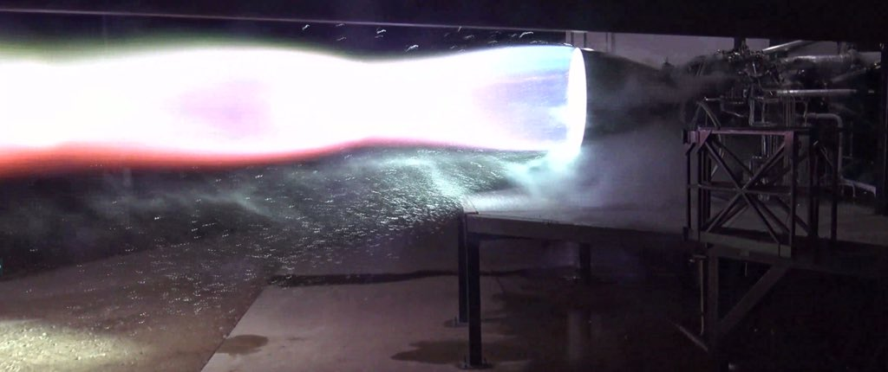

# SpaceX新一代星舰引擎点火成功

埃隆马斯克昨天在推特上发文：“星舰猛禽引擎，第一次点火成功！我为@SpaceX团队的成功感到无比自豪！”

> First firing of Starship Raptor flight engine! So proud of great work by @SpaceX team!! -- Elon Musk

本文封面正是猛禽引擎第一次点火的照片。

据arstechnica报道，猛禽引擎（Raptor Engine）是SpaceX的下一代引擎，既用于下一代超重火箭（Super Heavy Rocket），也用于将会访问火星的星舰（Starship）。今年上半年，SpaceX会进行一次“跳跃”测试，即火箭升空至大气层，然后再依靠自己的动力安全地落回到地面。而火箭与星舰一起升空的测试，预计在2020年上半年。[1]

> SpaceX is pushing hard on the development of its next-generation Super Heavy rocket and Starship spacecraft. This particular engine may end up as one of three engines used as part of the "hopper" tests of a Starship model later this spring, when the vehicle ascends into the lower atmosphere and then descends on its own power. The first launch of the rocket and Starship combined should come in the early 2020s.

与以往的引擎不同的是，猛禽引擎采用全新的燃料：低温液体甲烷（cryogenic liquid methane）和液氧（LOX），这与SpaceX以往使用的燃料RP-1煤油/LOX完全不同。猛禽殷勤的推动力大致会是当前Falcon 9火箭使用的Merlin引擎的两倍。[2]

> Raptor is a staged combustion, methane-fueled rocket engine under development by SpaceX. The engines are powered by cryogenic liquid methane and liquid oxygen (LOX), rather than the RP-1 kerosene and LOX used in all previous SpaceX Falcon rockets which use or used Merlin 1A, 1C, & 1D engines. The earliest concepts for Raptor considered liquid hydrogen (LH2) as fuel rather than methane. The Raptor engine will have about two times the thrust of the Merlin 1D engine that powers the current Falcon 9 launch vehicle.

值得注意的是，昨天正是有“美国春晚”之喻的超级碗比赛日。arstechnica认为这表示SpaceX因为近期陷入了财务危机，不得不加班加点，连“春节”也不放过。但我则认为，这两件事没有直接关联。他们加班加点也不是一天两天的事了。而且相对于超级碗，登陆火星显然是更令人激动的事情。

[1]: https://arstechnica.com/science/2019/02/spacex-test-fires-flight-version-of-its-raptor-engine-for-the-first-time/
[2]: https://en.wikipedia.org/wiki/Raptor_(rocket_engine_family)