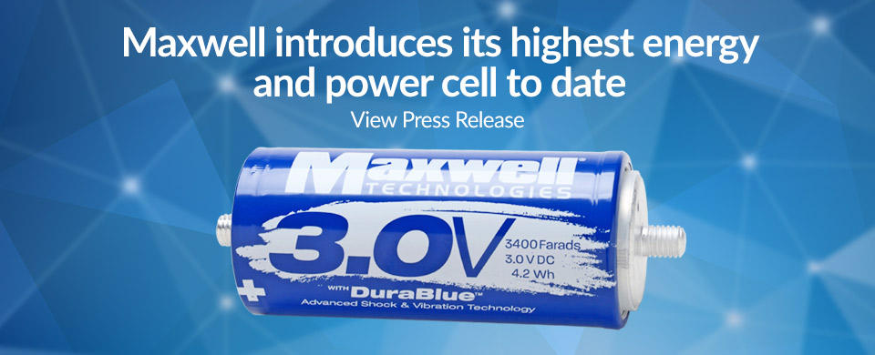

# Tesla acquires ultracapacitor and battery manufacturer for over $200 million
# 特斯拉超2亿美元收购超级电容与电池生产商Maxwell

前日，据electrek报道，特斯拉与总部在加州的Maxwell电池公司达成收购协议，以超过2亿美金的价格收购其全部股份，成为特斯拉的全资子公司。

这是特斯拉自创建以来的第5个重要收购。

特斯拉评论道：

> “We are always looking for potential acquisitions that make sense for the business and support Tesla’s mission to accelerate the world’s transition to sustainable energy.”

“我们一直在寻找潜在的收购对象，只要它们与特斯拉的业务相融，且符合特斯拉加速世界转向可持续能源的愿景。”

Maxwell总部位于加州圣迭戈，有380名员工。它最主要的产品是超级电容，而近期他们一直在宣传最新突破的干电极（dry electrode）技术，并声称已经找到了战略合作伙伴。

关于这次收购，Maxwell的主席兼首席执行官Dr. Franz Fink评论道：

> “We are very excited with today’s announcement that Tesla has agreed to acquire Maxwell. Tesla is a well-respected and world-class innovator that shares a common goal of building a more sustainable future. We believe this transaction is in the best interests of Maxwell stockholders and offers investors the opportunity to participate in Tesla’s mission of accelerating the advent of sustainable transport and energy.”

”我们非常高兴地通知大家，特斯拉已经同意收购Maxwell。特斯拉是行业中值得尊重的领袖，也是国际一流的创新者，与我们共同持有建造更持续化的未来的愿景。我们相信这次收购符合Maxwell的所有股东的最佳利益，而且为我们的投资方提供了非常好的机会，能够参与到特斯拉加速世界转向可持续化交通与能源的使命之中。“

Maxwell除了其突破性的干电极技术，其超级电容业务也值得关注。2018年前9个月，其超级电容业务报收9100万美元。

据eclectrek分析，

> Tesla’s acquisition of Maxwell might have little to do with ultracapacitors. The automaker might be more interested with Maxwell’s dry electrode technology that they have been hyping recently. Maxwell claims that its electrode enables an energy density of over 300 Wh/kg in current demonstration cells and they see a path to over 500 Wh/kg. This would represent a significant improvement over current battery cells used by Tesla and enable longer range or lighter weight, but that’s not even the most attractive benefit of Maxwell’s dry electrode. They claim that it should simplify the manufacturing process and result in a “10 to 20% cost reduction versus state-of-the-art wet electrodes” while “extending battery Life up to a factor of 2.”

特斯拉收购Maxwell可能是为了他们的干电极技术。Maxwell声称他们的干电极技术，现在已经将电池cell能量密度提升到300Wh/kg，并且有途径提高到500Wh/kg。这个数值比特斯拉当前使用的电池高出很多，可能提高其里程或降轻重量。并且他们的技术可以进一步简化生产流程，比当前的湿式电极技术能再降低10%~20%成本，并且电池使用寿命也能提高2倍。

衍星斋评：

特斯拉曾经同时跟踪世界上超过80个电池研究团队，并评估其效果，但一直没有收购过电池公司。自从上次聘请来锂电池顶级专家Jeff Dahn，特斯拉电池获得突破性进展之后，这是第一次针对电池技术的大收购。以特斯拉在技术收购上的保守性来判断，这次很可能是真的有所突破。谨慎看好未来5年内，电动车电池密度再上一个新台阶。

原文链接：https://electrek.co/2019/02/04/tesla-acquires-ultracapacitor-battery-manufacturer/