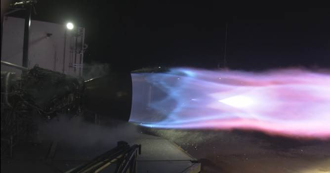
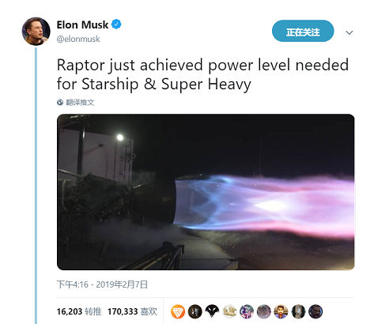
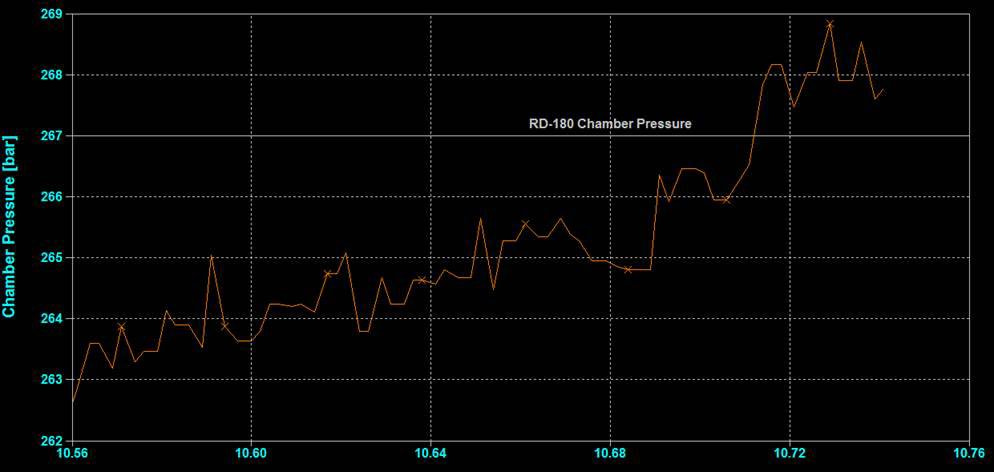

# SpaceX猛禽引擎动力已达目标值

马斯克7日下午发推：

> Raptor just achieved power level needed for Starship & Super Heavy

“猛禽引擎刚刚成功达到了星舰与SuperHeavy火箭所需要的能量级别。”

这是猛禽引擎测试中的一个很重要的里程碑。

接着他又说：

> Design requires at least 170 metric tons of force. Engine reached 172 mT & 257 bar chamber pressure with warm propellant, which means 10% to 20% more with deep cryo.

根据设计，猛禽引擎需要达到170吨推力。测试中，猛禽引擎使用常温燃料达到了172mT推力和257巴的燃烧室压力。这表示如果使用深冷处理燃料，还会再提高10%~20%。

之后马斯克分享了引擎测试的数据，如下图所示。数据展示猛禽引擎的燃烧室压力超过了俄罗斯的RD-180引擎，创造了新的记录。

> Raptor reached 268.9 bar today, exceeding prior record held by the awesome Russian RD-180. Great work by @SpaceX engine/test team!

“今天猛禽引擎（舱内压强）最高达到了268.9巴，超过了俄罗斯强大的RD-180引擎之前保持的最高记录。@SpaceX工程和测试团队，你们做的真棒！”

---

我们再看看Space.com对这个消息的报道：

> A test fire of SpaceX's newest engine reached the power level necessary for the company's next round of rocket designs, CEO Elon Musk said on Twitter.

SpaceX的CEO亿隆马斯克在推特上宣布，他们最新的引擎达到了下一代火箭设计需求的能量级别。

> "Raptor just achieved power level needed for Starship & Super Heavy," he tweeted on Feb. 7, four days after he shared a photograph of the first test of a flight-ready engine.

马斯克2月7日的推文说：“猛禽引擎刚刚成功达到了星舰与SuperHeavy火箭所需要的能量级别。”。这一天离他宣布成品猛禽引擎点火成功才刚刚过去4天。

> The Raptor engine is designed to power the spaceship currently known as Starship as part of the rocket assembly currently known as Super Heavy (previously dubbed the BFR). The first Raptor test fire took place in September 2016, when the company was targeting an uncrewed Mars launch in 2018.

猛禽引擎设计用于星舰本身，以及送星舰上天的重型火箭“超重号”（之前取名为BFR）。猛禽引擎的第一次点火测试发生在2016年9月，当时公司设定的目标是2018年实现无人登陆火星。

> Three Raptor engines like this one are built in to the Starship Hopper, which has been under construction in Texas and which SpaceX will use to begin testing the rocket technology in real life.

SpaceX正在德州建造Starship Hopper（星舰跳跃者）测试火箭，上面会安装3个猛禽引擎。该火箭用于实地测试星舰及超重号的火箭技术。

> Eventually, SpaceX plans to assemble 31 Raptor engines into the Super Heavy rockets, with another seven Raptors on the Starship itself. The engines are fueled by a mix of liquid methane and liquid oxygen and are about twice as powerful as those aboard the Merlin engines currently flying in the company's Falcon 9 and Falcon Heavy engines.

最终，SpaceX计划在超重号上安装31个猛禽引擎，另外在星舰自身上也安装7个。猛禽引擎的燃料由液态甲烷和液氧混合而成，推动力大概是公司现有的猎鹰9号和猎鹰重型火箭上使用的Merlin殷勤的两倍。

原文链接：
https://www.space.com/43289-spacex-starship-raptor-engine-launch-power.html