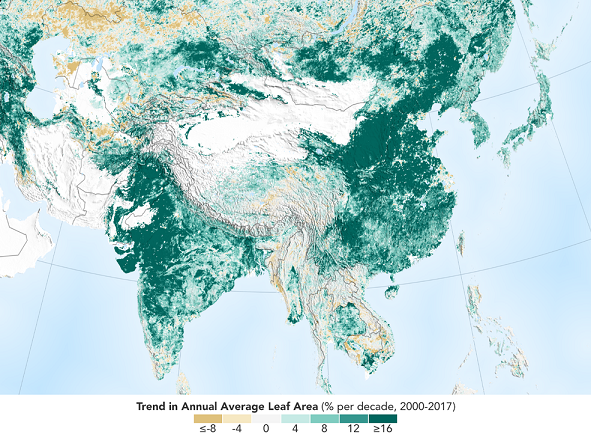
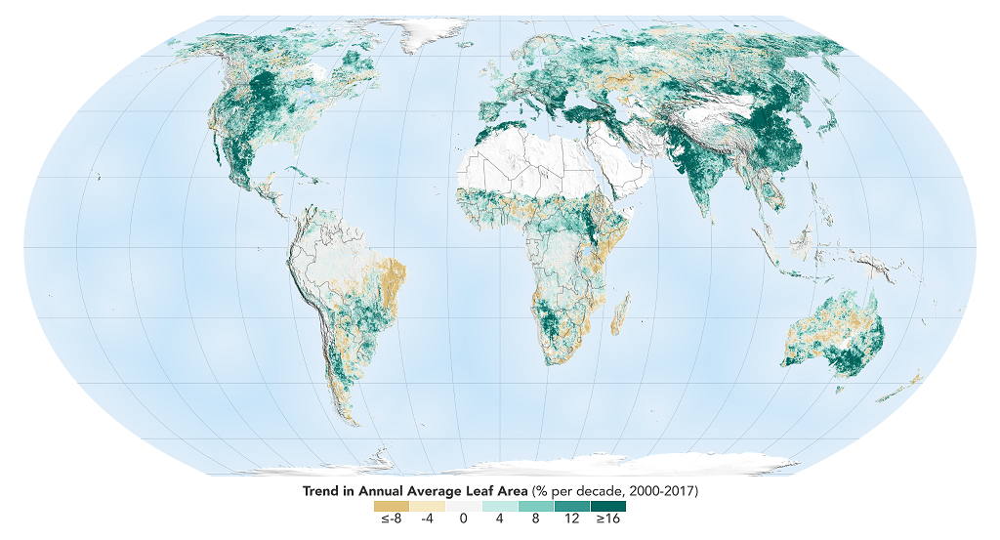
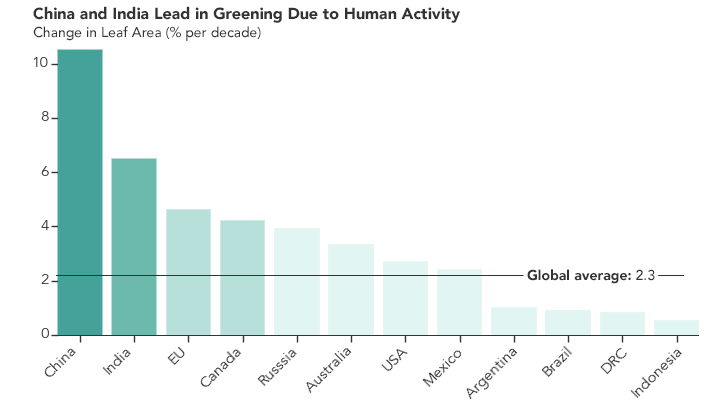

# 极客录 NASA研究表明，中国和印度是近几十年全球植被绿化的最大贡献者

> Over the last two decades, the Earth has seen an increase in foliage around the planet, measured in average leaf area per year on plants and trees. Data from NASA satellites shows that China and India are leading the increase in greening on land. The effect stems mainly from ambitious tree planting programs in China and intensive agriculture in both countries.
> Credits: NASA Earth Observatory

最近二十年来，以年均草木绿叶覆面积来衡量，全球的植被出现了增长的趋势。NASA的卫星数据显示，中国和印度是陆地绿化增长的最主要贡献者。分析表示这主要来源于中国雄心勃勃的植树计划，以及两国频繁的农业活动。图片来源：NASA地球气象台。

> The world is literally a greener place than it was 20 years ago, and data from NASA satellites has revealed a counterintuitive source for much of this new foliage: China and India. A new study shows that the two emerging countries with the world’s biggest populations are leading the increase in greening on land. The effect stems mainly from ambitious tree planting programs in China and intensive agriculture in both countries.

全世界的绿化面积比20年前更多了。NASA的卫星调查揭示了令人意外的原因：大部分新增绿化面积都来自于中国和印度。一项新研究表明，这两个世界人口最多的新兴国家，正是陆地植被绿化的引领者。分析表明，新增的绿化面积主要来源于中国雄心勃勃的植树计划，以及两国频繁的农业活动。

> The greening phenomenon was first detected using satellite data in the mid-1990s by Ranga Myneni of Boston University and colleagues, but they did not know whether human activity was one of its chief, direct causes. This new insight was made possible by a nearly 20-year-long data record from a NASA instrument orbiting the Earth on two satellites. It’s called the Moderate Resolution Imaging Spectroradiometer, or MODIS, and its high-resolution data provides very accurate information, helping researchers work out details of what’s happening with Earth’s vegetation, down to the level of 500 meters, or about 1,600 feet, on the ground.

地球绿化增多的现象，最早发现于1990年中期，由波士顿大学的Ranga Myneni团队通过卫星数据发现的。但是他们当时并不知道人类活动是否是直接导致这个现象的主因。依靠NASA两颗绕地卫星上的仪器连续20年收集到的数据，使得这次的新发现成为可能。这个仪器叫做Modereate Resolution Imaging Spectroradiometer（中等分辨率成像分光辐射计），简称MODIS。它获取的高分辨率数据为研究者提供了非常准确的信息，帮助他们看清地球的植被到底发生了什么。MODIS的地面清晰度到达了500米（1600英尺）。

> Taken all together, the greening of the planet over the last two decades represents an increase in leaf area on plants and trees equivalent to the area covered by all the Amazon rainforests. There are now more than two million square miles of extra green leaf area per year, compared to the early 2000s – a 5% increase.

最近二十年，地球增加的绿叶面积，包括树木和其他植物，全部加起来的话，可以覆盖整个亚马逊雨林。相比于2000年初，现在每年新增的绿叶面积超过了2百万平方英里——相当于5%的增量。

正如上图所示，地球比20年前绿化更多了。图中绿色越浓的地区，表示绿化增加越多。

> “China and India account for one-third of the greening, but contain only 9% of the planet’s land area covered in vegetation – a surprising finding, considering the general notion of land degradation in populous countries from overexploitation,” said Chi Chen of the Department of Earth and Environment at Boston University, in Massachusetts, and lead author of the study.

“中国和印度贡献了三分之一的新增绿化面积，但是它们总共只占全球9%的陆地植被面积。这是一个令人惊奇的发现。而往常人们则认为，人口过密的地区都会伴随过度采伐与陆地退化现象。”麻省波士顿大学地球与环境系的陈驰（音译）说。他是这个研究的第一作者。

这个图可以清晰的看到中国和印度所占的贡献比

> An advantage of the MODIS satellite sensor is the intensive coverage it provides, both in space and time: MODIS has captured as many as four shots of every place on Earth, every day for the last 20 years.

MODIS卫星探测器的一个优势在于它同时在空间上和时间上都提供了很高的覆盖率：最近20年来，对地球上的每个地方，MODIS平均每天拍下了4张高清照片。

> “This long-term data lets us dig deeper,” said Rama Nemani, a research scientist at NASA’s Ames Research Center, in California’s Silicon Valley, and a co-author of the new work. “When the greening of the Earth was first observed, we thought it was due to a warmer, wetter climate and fertilization from the added carbon dioxide in the atmosphere, leading to more leaf growth in northern forests, for instance. Now, with the MODIS data that lets us understand the phenomenon at really small scales, we see that humans are also contributing.”

新研究的合著者，加州硅谷NASA Ames研究中心的研究科学家Rama Nemani说：“这些长期数据帮助我们更深地挖掘问题所在。当地球绿化的增加第一次被发现时，我们曾以为，其原因是更温暖湿润的气候，以及大气中增加的二氧化碳提供的更多养分，导致了北方森林绿叶面积的增加。但现在，通过MODIS的数据，我们可以比以往更精确的了解这些现象。我们发现人类也在做出贡献”。

> China’s outsized contribution to the global greening trend comes in large part (42%) from programs to conserve and expand forests. These were developed in an effort to reduce the effects of soil erosion, air pollution and climate change. Another 32% there – and 82% of the greening seen in India – comes from intensive cultivation of food crops.

中国对全球绿化的突出贡献，主要来自于保护与扩张森林的计划（占42%）。这些计划主要是为了对应水土流失、空气污染以及气候变迁。另外32%，印度绿化增长的82%，则来自于频繁的农作物种植。

> Land area used to grow crops is comparable in China and India – more than 770,000 square miles – and has not changed much since the early 2000s. Yet these regions have greatly increased both their annual total green leaf area and their food production. This was achieved through multiple cropping practices, where a field is replanted to produce another harvest several times a year. Production of grains, vegetables, fruits and more have increased by about 35-40% since 2000 to feed their large populations.

中国和印度用于农业种植的土地面积差不多大，都超过77万平方英里，而且自从2000年初以来，一直没有发生过变化。但是这些地区的年均绿叶面积和粮食产量都已经大大增加。这主要是由于播种季数的增加：同一片土地，收获之后再度播种，使得当年可以再多收获一季。为了供养两国庞大的人口，谷物、蔬菜、水果等农产品的产量比2000年初增长了35-40%。

> How the greening trend may change in the future depends on numerous factors, both on a global scale and the local human level. For example, increased food production in India is facilitated by groundwater irrigation. If the groundwater is depleted, this trend may change.

这个绿化增多的趋势未来会如何变化，还依赖于多种因素，包括全球以及当地的人类因素。例如，印度粮食产量的增加主要来自于地面水系灌溉。如果地面水系被耗尽了，那这种趋势就可能改变。

> “But, now that we know direct human influence is a key driver of the greening Earth, we need to factor this into our climate models,” Nemani said. “This will help scientists make better predictions about the behavior of different Earth systems, which will help countries make better decisions about how and when to take action.”

“但是，现在我们知道了人类的直接影响是地球绿化的关键因素，就需要把这些因素加入到我们的气候模型中，”Nemani说道，“这样可以帮助科学家更好地做出关于各种地球系统的预测，进而帮助各国更好地做出决策，来决定如何或何时采取行动。”

> The researchers point out that the gain in greenness seen around the world and dominated by India and China does not offset the damage from loss of natural vegetation in tropical regions, such as Brazil and Indonesia. The consequences for sustainability and biodiversity in those ecosystems remain.

研究者们还指出，通过中国和印度的贡献，世界新增的绿色植被，并不能挽回热带地区的雨林损失。比如巴西和印尼，那些地区的生态环境的可持续性和生物多样性的损失，都很难挽回。

> Overall, Nemani sees a positive message in the new findings. “Once people realize there’s a problem, they tend to fix it,” he said. “In the 70s and 80s in India and China, the situation around vegetation loss wasn’t good; in the 90s, people realized it; and today things have improved. Humans are incredibly resilient. That’s what we see in the satellite data.”

总体来说，Nemani认为这些新发现传达了正面的消息。“一旦人们发现了问题，他们就会去解决它，”他说，“70年代和80年代，印度和中国的植被流失问题情况很糟；90年代，人们意识到了这个问题；而到了今天，情况已经大大改善了。人类的韧性真令人惊奇。这就是我们从卫星数据中得到的发现。”

> This research was published online, Feb. 11, 2019, in the journal Nature Sustainability.

这个研究于2019年2月11日发表Nature Sustainability在线杂志。

> Author: Abby Tabor, NASA's Ames Research Center, Silicon Valley

原文作者：Abby Tabor，硅谷NASA Ames研究中心

---

衍星斋评：

在最近贸易战导致的中美关系摩擦的大背景下，终于在西方媒体看到一个中国的正面消息，真是不容易。这篇文章来自NASA，也正说明了科学家们是更加客观的报道者。

中国的绿化和环保政策，以及千千万万战斗在第一线的林业职工和环保职工，是值得全世界肯定的。正如这篇研究的作者所说：“人类的韧性真令人惊奇”。希望随着造林植树运动的进一步深化，随着可持续的环保政策进一步落实，随着新能源产业的井喷式扩张，中国能成为更加宜居的地方。也希望在中国的引领下，全球能在12~15年的气候变迁红线之前，成功控制住碳排放，转变为可持续的能源结构。毕竟绿水青山，就是金山银山。

---

论坛链接：
https://www.reddit.com/r/biology/comments/apv4w6/human_activity_in_china_and_india_dominates_the/

原文链接：
https://www.nasa.gov/feature/ames/human-activity-in-china-and-india-dominates-the-greening-of-earth-nasa-study-shows